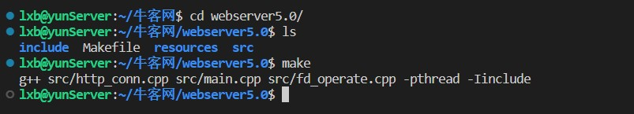
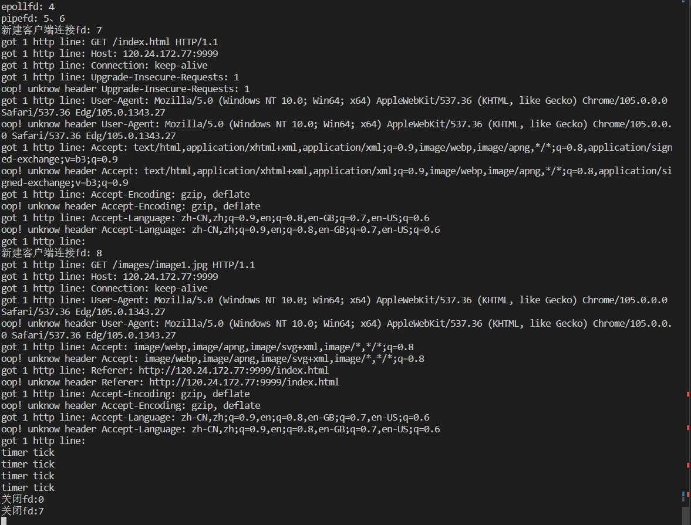
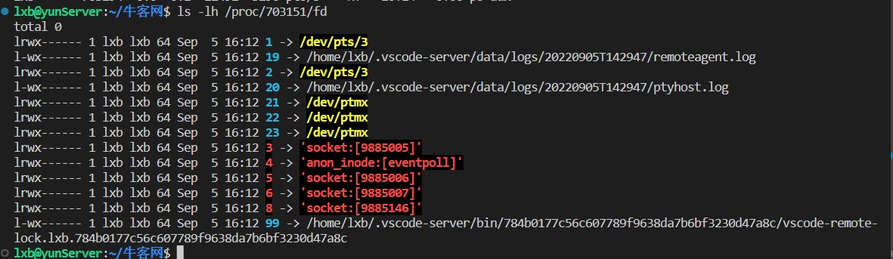
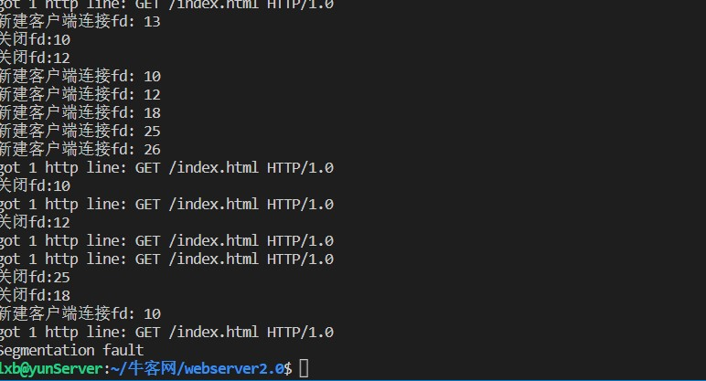
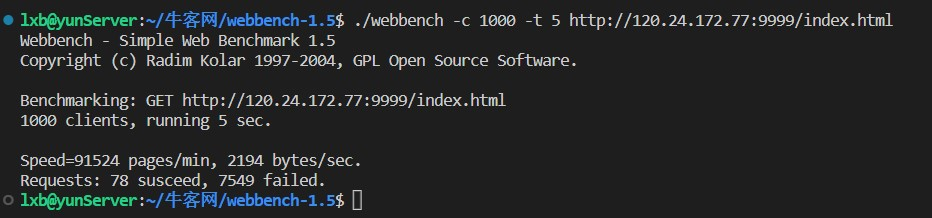
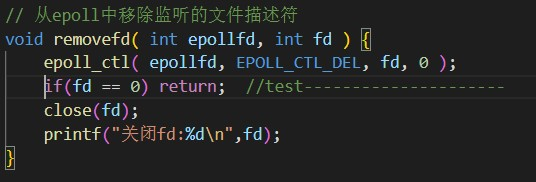
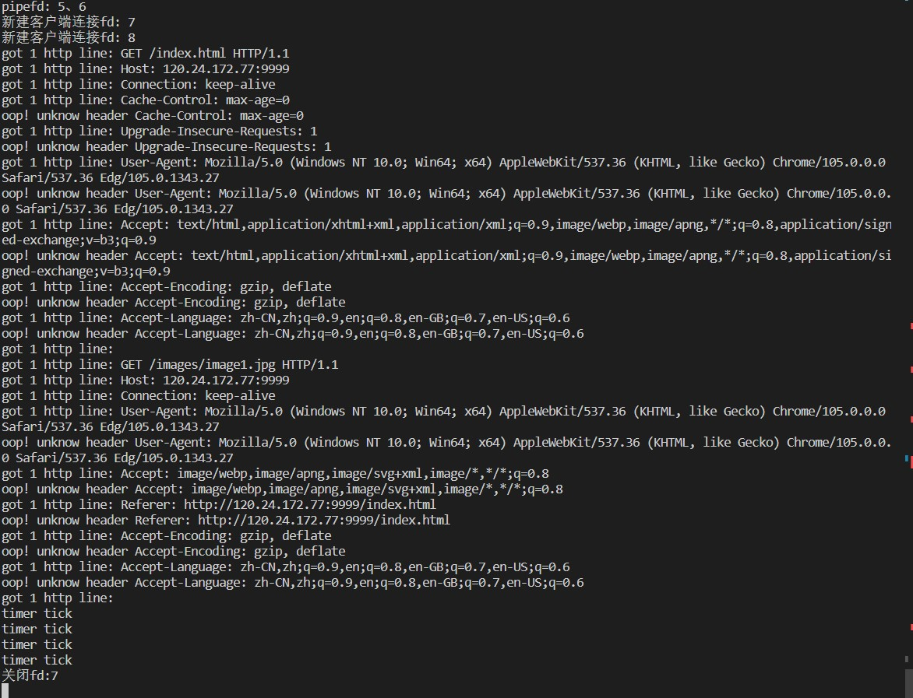
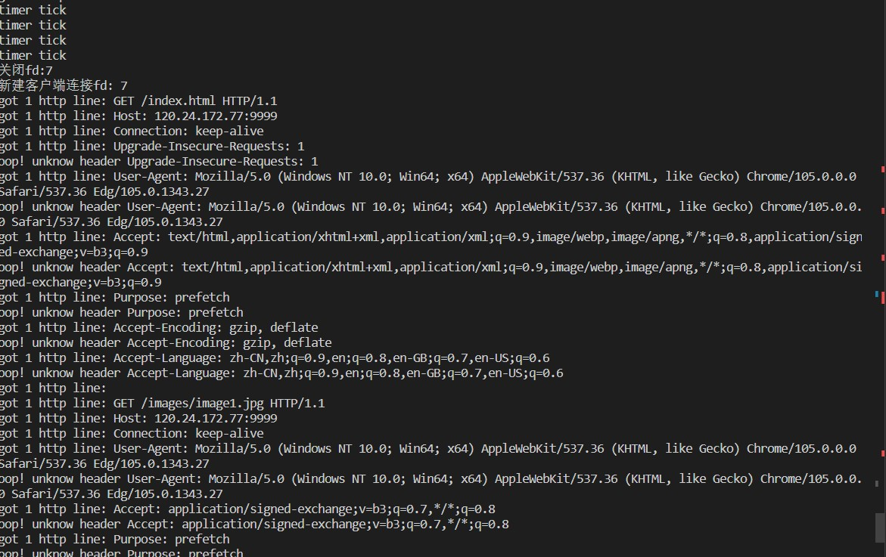
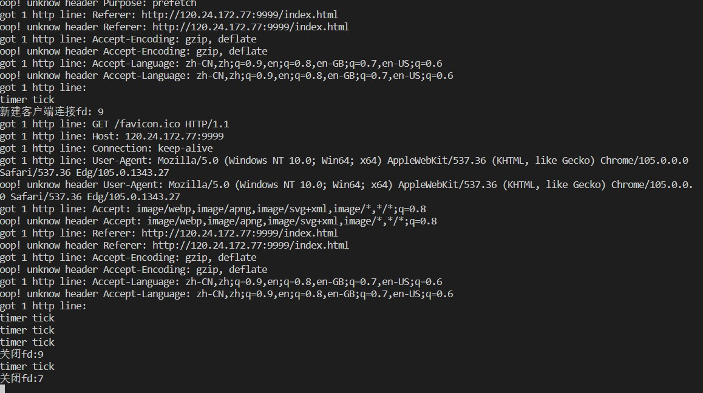
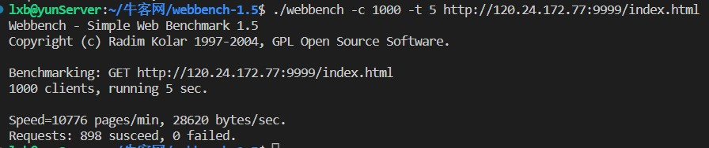

# 基于Linux的轻量级C++ Web服务器

## 1、 简介

​		本项目是基于游双老师的《Linux高性能服务器编程》编写的C++ Web服务器 ，支持get请求，可处理静态资源；并添加了定时检测、关闭非活跃连接的功能。

## 2、编译及运行

### 2.1、编译

### 2.2、运行

（1）服务端使用端口9999，服务端进程运行起来后先创建线程池，其中有8个线程。服务端进程的文件描述符表中0、1、2是默认打开的标准输入、标准输出和标准错误，3号fd是使用socket函数打开的用于监听客户端连接的fd，4号fd是使用epoll_create函数打开的，5号、6号是为了检测非活跃连接创建的管道的读端和写端，读端添加到epoll进行监听，使用alarm函数产生SIGALRM信号，使用sigaction函数捕捉信号，信号处理函数向管道的写端发送数据，epoll检测到后会检测非活跃连接，然后再次调用alarm函数产生信号，从而做到定时检测非活跃连接

（2）使用浏览器访问网站资源

​		index.html中还有一张图片，所以浏览器会分两次请求资源，会建立两个连接，分别对应服务器端的fd7和fd8，每次timer tick表示进行了一次非活跃连接的检测，第四次检测时发现连接超时，关闭了该连接

### 2.3、BUG

​		2.2中  关闭连接时我发现一个问题，服务端打开的fd是7和8，但是关闭的却是0和7，通过查看服务端进程打开的fd，发现8号fd还被占用着没有关闭，这种情况出现概率很大，但有时也会出现正常情况，即关闭的也是7和8

此时使用webbench测试，发现并发量较大时服务端进程会异常终止，如下图

​		后来我发现服务端进程运行过程中用于记录8号fd的变量的值会在某一时刻由于不明原因变成0，由于找不到原因，只好在关闭fd之前进行判断，如果fd == 0 ,就返回，如下图

修改后重新测试：第一次访问服务端，创建了fd7和fd8，只关闭了fd7

第二次访问服务端：由于8号fd仍然打开着，因此这次打开的fd是 7 和 9，而关闭时正常关闭了 7 和 9

再次使用webbench测试：服务端运行正常

### 2.4、总结

​		关于2.3中 bug的解决方式，虽然可以使服务端程序正常运行，但是问题的原因还是没有找到，希望通过后续的学习可以弄明白。

